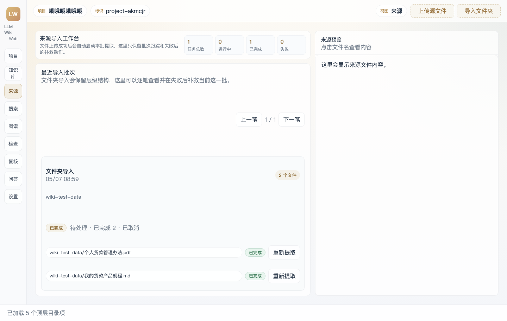
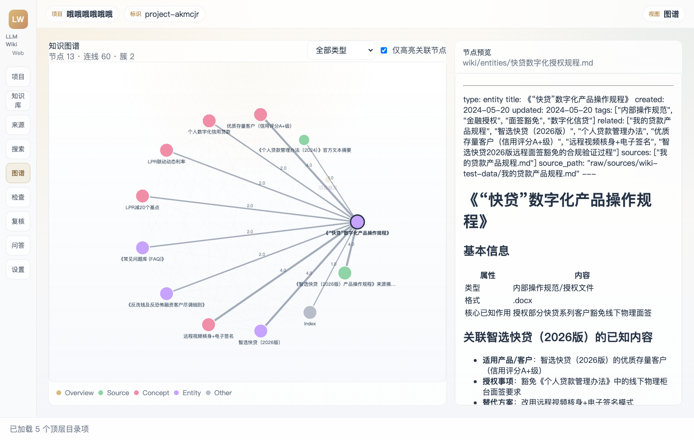
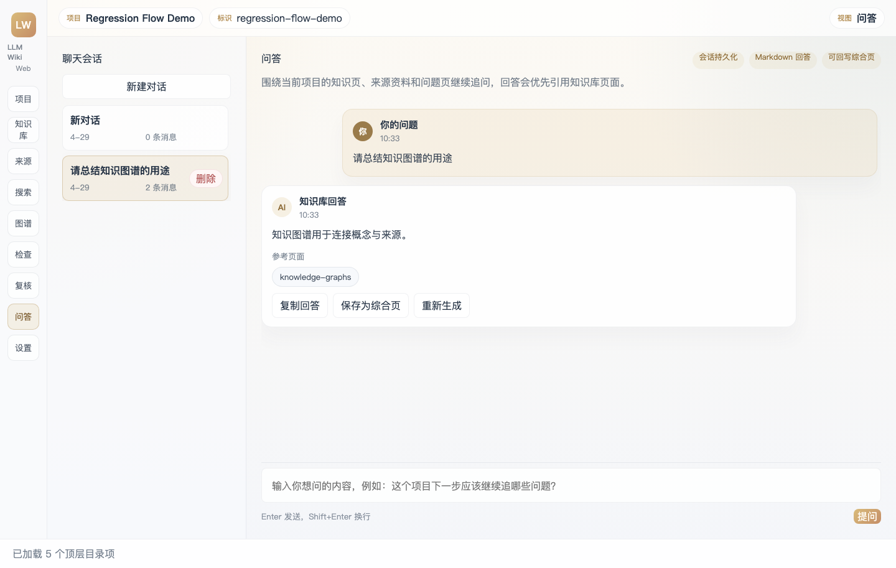

# LLM Wiki Rewrite

一个基于本地文件系统的 LLM Wiki Web 应用。

这个项目把原来的桌面版工作流改成了浏览器 + Node.js 服务的形式，保留了“来源导入 -> 知识提取 -> 知识库整理 -> 搜索 / 图谱 / 问答”的主链路，同时继续使用项目目录作为数据模型，不依赖数据库。

## 运行界面

### 来源页



### 知识图谱页



### 问答页



## 功能概览

- 项目创建、删除、切换
- 来源文件上传 / 文件夹导入
- 上传后自动提取、单文件重提取、失败批次补救
- Markdown / 文本预览
- PDF / DOCX / XLSX / PPTX 文本提取与缓存
- 知识库生成：
  - `wiki/sources`
  - `wiki/concepts`
  - `wiki/entities`
  - `wiki/queries`
  - `wiki/synthesis`
- 搜索、知识图谱、复核、检查
- 项目内多会话问答
- 聊天回答保存为综合页
- Docker / Docker Compose 启动

## 主要功能

### 1. 以项目目录为中心的知识库

- 每个 Wiki 项目都保存在本地文件系统里，不依赖数据库
- 项目结构和原版工作流保持一致，便于迁移现有资料
- 生成内容会回写到 `wiki/` 目录，适合继续人工编辑和版本管理

### 2. 来源导入与自动提取

- 支持上传单文件、多文件、整个文件夹
- 上传成功后自动启动当前批次的知识提取
- 来源页会直接显示批次状态、文件级阶段和失败后的补救动作
- 同一批文件重复点击不会反复创建重复任务

### 3. 文档解析与缓存复用

- 支持 `md/txt/csv/pdf/doc/docx/xlsx/pptx`
- `pdf/doc/docx/xlsx/pptx` 会先提取文本，再缓存到项目内部目录
- 后续预览、搜索、问答都会优先复用这些缓存文本
- 当前项目已经不再依赖 Python 运行时

### 4. 自动生成知识页

- 来源提取采用两阶段流程：
  1. `analysis`
  2. `generation`
- 生成结果会写入：
  - `wiki/sources`
  - `wiki/concepts`
  - `wiki/entities`
  - `wiki/queries`
  - `wiki/synthesis`
- 同时更新 `wiki/index.md`、`wiki/overview.md` 和 `wiki/log.md`

### 5. 知识浏览、搜索与图谱

- 知识库页支持来源树、知识分类、Markdown 编辑与预览
- 搜索页可以直接命中知识页和来源缓存文本
- 图谱页支持节点筛选、拖动、邻居高亮和右侧节点预览
- 点击引用或图谱节点时，会尽量在当前工作流里完成联动，不强制打断页面上下文

### 6. 问答与知识沉淀

- 支持项目级多会话聊天
- 支持流式 / 非流式回答切换
- 会把知识页、图谱关联页和来源缓存文本一起纳入上下文
- 回答支持引用页跳转，并可一键保存为 `wiki/synthesis/*`

### 7. 部署与运维

- 支持本地直接启动
- 支持通过 `HOST=0.0.0.0` 暴露到局域网
- 提供 `Dockerfile` 和 `docker-compose.yml`
- 数据目录和日志目录都支持外挂，方便迁移和备份

## 功能矩阵

| 模块 | 当前状态 | 说明 |
| --- | --- | --- |
| 项目管理 | 已完成 | 支持新建、删除、切换项目 |
| 来源上传 | 已完成 | 支持文件上传、文件夹导入、隐藏文件过滤 |
| 来源批次管理 | 已完成 | 支持最近导入批次查看、只提取本批、取消本批待处理、批次去重 |
| 单文件重提取 | 已完成 | 支持对来源文件单独重新提取 |
| 提取任务 | 已完成 | 支持任务状态、失败重试、批次任务与单文件任务区分 |
| 文档解析 | 已完成 | 支持 `md/txt/csv/pdf/doc/docx/xlsx/pptx`，且不依赖 Python |
| 来源文本缓存 | 已完成 | `pdf/doc/docx/xlsx/pptx` 会缓存提取文本，供预览、搜索、问答复用 |
| 知识库生成 | 已完成 | 生成 `sources/concepts/entities/queries/synthesis/index/overview/log` |
| 中文文件名 | 已完成 | 中文标题生成的知识页文件名可直接使用中文 |
| 知识库浏览 | 已完成 | 支持来源树、知识分类、编辑、Markdown 预览、下载 |
| 搜索 | 已完成 | 支持项目内搜索，并可利用来源缓存文本 |
| 知识图谱 | 已完成 | 支持节点展示、类型筛选、邻居高亮、右侧节点预览 |
| 复核 | 已完成 | 支持开放问题、待处理项 |
| 检查 | 已完成 | 支持断链、孤立页、缺少外链等结构检查 |
| 问答 | 已完成 | 支持多会话、流式/非流式、重新生成、引用页、综合页回写 |
| 设置页 | 已完成 | 支持 LLM、输出语言、搜索、Embedding 配置项、问答输出模式 |
| Docker 部署 | 已完成 | 支持 Dockerfile、Compose、外挂数据目录、外挂日志 |
| 局域网访问 | 已完成 | 支持通过 `HOST=0.0.0.0` 监听内网地址 |
| Deep Research | 未完成 | 联网研究工作流尚未迁移 |
| 图片 OCR / 多模态 | 未完成 | 图片理解与 OCR 还未接入 |
| Embedding 真正接入检索 | 未完成 | 设置项已预留，但主链路未启用向量检索 |
| 老式 `.doc` 支持 | 已完成 | `.doc` 会和 `.docx` 一样参与提取、缓存、预览和检索 |

## 技术栈

- 前端：原生 HTML / CSS / JavaScript
- 后端：Node.js（ESM）
- 文档提取：
  - PDF：本地 vendored `pdf.js`
  - DOC：本地 vendored `word-extractor`
  - DOCX / XLSX / PPTX：`jszip` + XML 解析
  - 文本文件：原生 `TextDecoder`

## 运行要求

- Node.js 18 及以上
- 推荐 Node.js 20

说明：

- 项目问答和知识提取依赖 Node 18+ 的全局 `fetch`
- 当前项目**不依赖 Python**

## 目录结构

```text
.
├── data/                    # 本地开发默认数据目录
│   ├── projects/
│   ├── settings.json
│   ├── tasks.json
│   └── logs/
├── docker/
│   └── entrypoint.sh
├── server/
│   └── src/
├── shared/
├── vendor/
│   ├── pdfjs/
│   └── word-extractor/
├── web/
├── Dockerfile
├── docker-compose.yml
└── package.json
```

## 本地启动

安装依赖：

```bash
npm install
```

启动服务：

```bash
npm run dev
```

默认访问地址：

```text
http://127.0.0.1:4000
```

## 局域网访问

如果你希望用内网 IP 访问，而不是只在本机访问：

```bash
HOST=0.0.0.0 PORT=4000 npm run dev
```

然后用当前机器的内网 IP 访问，例如：

```text
http://192.168.1.23:4000
```

macOS 查看内网 IP：

```bash
ipconfig getifaddr en0
```

如果是另一块网卡，也可能是：

```bash
ipconfig getifaddr en1
```

## 数据目录

项目默认使用本地目录：

```text
./data
```

其中：

- `data/projects/`：所有 Wiki 项目
- `data/settings.json`：全局设置
- `data/tasks.json`：任务记录
- `data/logs/`：服务日志

可以通过环境变量改掉数据根目录：

```bash
DATA_ROOT=/absolute/path/to/data npm run dev
```

## Docker 启动

构建镜像：

```bash
docker build -t llm-wiki-rewrite .
```

运行容器：

```bash
docker run --rm -p 4000:4000 \
  -e DATA_ROOT=/app/data \
  -v /your/local/wiki-data:/app/data \
  llm-wiki-rewrite
```

访问：

```text
http://127.0.0.1:4000
```

### Docker Compose

直接启动：

```bash
docker compose up --build
```

默认映射：

- 端口：`4000`
- 数据目录：`./docker-data`

也可以覆盖：

```bash
LLM_WIKI_PORT=4100 \
LLM_WIKI_DATA_DIR=/absolute/path/to/wiki-data \
docker compose up --build
```

### Docker 数据与日志

容器内统一数据目录：

```text
/app/data
```

其中日志会写到：

```text
/app/data/logs/server.log
```

## LLM 设置

启动后进入 `设置` 页面，至少需要配置：

- 接口地址
- 模型名
- API Key
- 协议模式
- 是否启用 LLM 提取与问答

目前支持的模式包括：

- Anthropic Messages
- OpenAI Chat Completions

## 文档提取与缓存

支持提取的来源类型：

- `.md`
- `.markdown`
- `.txt`
- `.csv`
- `.pdf`
- `.doc`
- `.docx`
- `.xlsx`
- `.pptx`

说明：

- `pdf/doc/docx/xlsx/pptx` 提取后的文本会缓存到项目内部
- 问答和检索会复用这些缓存文本
- 如果来源文件已有缓存文本，预览时也会优先显示缓存内容

当前**不支持**老式 `.doc`

## 主要页面说明

- `项目`
  - 创建 / 删除 / 切换项目
- `知识库`
  - 浏览知识页
  - 来源树
  - 编辑与预览
- `来源`
  - 上传文件
  - 导入文件夹
  - 自动提取当前批次
  - 查看最近导入批次
  - 在当前页右侧直接预览来源内容
- `搜索`
  - 项目内搜索
- `知识图谱`
  - 查看页面关系
  - 点击节点后在右侧预览内容
- `复核`
  - 开放问题
  - 待处理项
- `检查`
  - 结构检查（断链、孤立页、缺少外链）
- `问答`
  - 多轮会话
  - 流式 / 非流式回答
  - 回答保存为综合页

## 目前的实现边界

当前版本已经能跑完整主流程，但仍有一些边界：

- 不依赖数据库，完全基于本地文件系统
- 不支持 `.doc`
- 图片 OCR / 多模态提取还未完成
- Deep Research / 联网研究流还未完成
- Embedding / 向量检索未接入

## 常见问题

### 1. 新项目为什么会看到旧任务？

这个问题已经修复。切换项目时，来源页状态会先清空，再加载当前项目的数据。

### 2. PDF 为什么能预览成文本？

因为系统会：

1. 提取 PDF 文本
2. 保存到项目缓存目录
3. 后续预览 / 问答 / 搜索都优先使用缓存文本

### 3. 同一批文件重复点击“只提取本批”会怎样？

当前实现已经做了去重：

- 同一批来源不会重复生成多条导入批次记录
- 如果同一批任务已经在排队或运行，不会重复创建新的提取任务

## 开发说明

### 运行脚本

```bash
npm run dev
```

### 服务端入口

- [server/src/app.js](/Users/madongyu/Documents/AgentCode/llm_wiki_rewrite/server/src/app.js)

### 运行配置

- [server/src/bootstrap.js](/Users/madongyu/Documents/AgentCode/llm_wiki_rewrite/server/src/bootstrap.js)

### 文档提取

- [server/src/services/document-extractor.js](/Users/madongyu/Documents/AgentCode/llm_wiki_rewrite/server/src/services/document-extractor.js)

### 来源与批次逻辑

- [server/src/services/import-history.js](/Users/madongyu/Documents/AgentCode/llm_wiki_rewrite/server/src/services/import-history.js)
- [server/src/services/ingest.js](/Users/madongyu/Documents/AgentCode/llm_wiki_rewrite/server/src/services/ingest.js)
- [server/src/services/tasks.js](/Users/madongyu/Documents/AgentCode/llm_wiki_rewrite/server/src/services/tasks.js)

---

如果你准备部署到局域网服务器或容器环境，优先建议走 Docker Compose。这样数据目录、端口和日志路径都会更清楚，迁移也更轻松。
